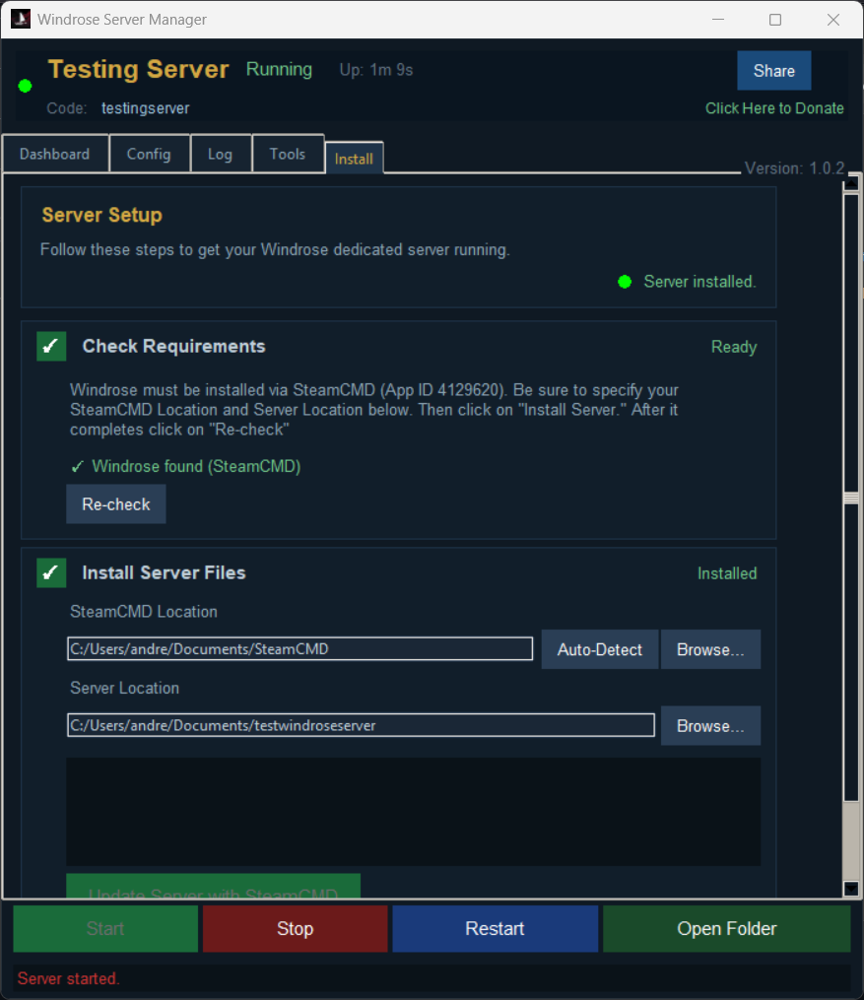

# Windrose Server Manager Enhanced

An Open Source dedicated server manager for [Windrose](https://store.steampowered.com/app/3041230/Windrose/)

> This is a Python adaptation of the Windrose Server Manager project (https://github.com/psbrowand/Windrose-Server-Manager). It includes additional features such as native SteamCMD support and other enhancements. Since I’m not very experienced with PowerShell, I created this Python version to better maintain and expand the application.

| Dashboard                          | Config                       |
| ---------------------------------- | ---------------------------- |
|  |  |

| Log                    | Install                        |
| ---------------------- | ------------------------------ |
|  |  |


---

## Features

- **Steam and SteamCMD support** - With ability to switch on-demand
- **Guided Installation Wizard** — When first launching the Server Manager you will be guided on how to get your dedicated server up and running via Steam or SteamCMD
- **One-click Start / Stop / Restart**
- **Automated Game Server Updater**
- **Automated Server Manager Updater**
- **Live dashboard** — CPU usage, RAM, player count, uptime, and connected player list
- **Live log viewer** — color-coded, filterable (All / Players / Warnings / Errors) with auto-scroll toggle
- **Config editor** — Edit Server and Gameplay settings directly from the manager
- **One-click world backup** — Zip your save data to a timestamped archive
- **Auto-backup** — Schedule automatic backups at 1, 4, 8, 16, or 24-hour intervals
- **Scheduled daily restarts**
- **Auto-restart on crash** — Relaunches automatically if the server is not running
- **Player history** — Persistent log of who joined and left
- **Invite code share** — Copies a ready-to-send message to clipboard
---

## Requirements

- Windows 10 or Windows 11

---

### How to Run

1. **Download the latest version**: - Extract the .zip to a folder of your choice
   ```
   https://github.com/Andrew1175/Windrose-Server-Manager-Enhanced/releases/latest
   ```
2. **Run `Windrose-Server-Manager.exe`**
3. Follow the Setup Wizard to configure a new dedicated server or to use your pre-existing one.
4. Click **Install Server** — Only if using SteamCMD.
5. Switch to the **Dashboard** tab and click **Start**.

---

## Application Guide

| Tab | What it does |
|---|---|
| **Dashboard** | Live stats, player list, auto-restart toggle |
| **Config** | Edit `ServerDescription.json` and `WorldDescription.json` via form fields and sliders |
| **Log** | Live-tailing server log with color coding and filters (All / Players / Warnings / Errors) |
| **Tools** | Automated Server Manager Updater, Patch Notes, Manual and Auto Backup, Scheduled Restarts |
| **Install** | Configure Server Directories, Automated Game Server Updater, Verify everything is installed properly |

---

## Contributers

Original Design By: (https://github.com/psbrowand/Windrose-Server-Manager)
