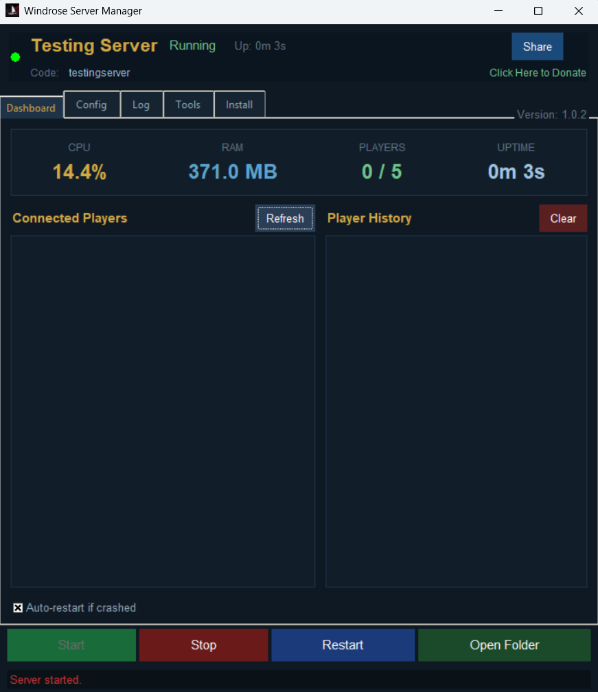
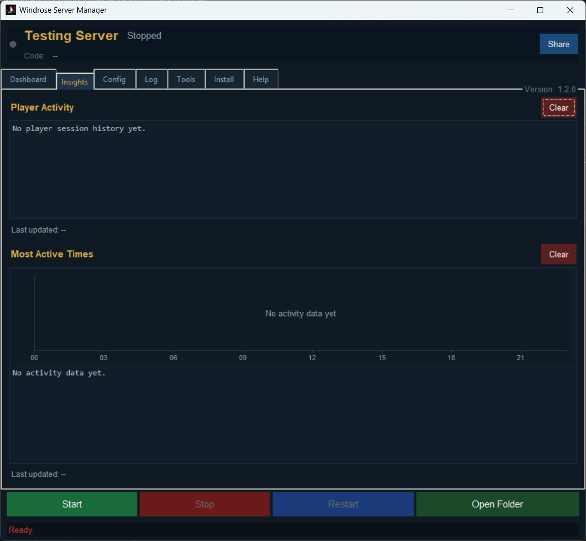
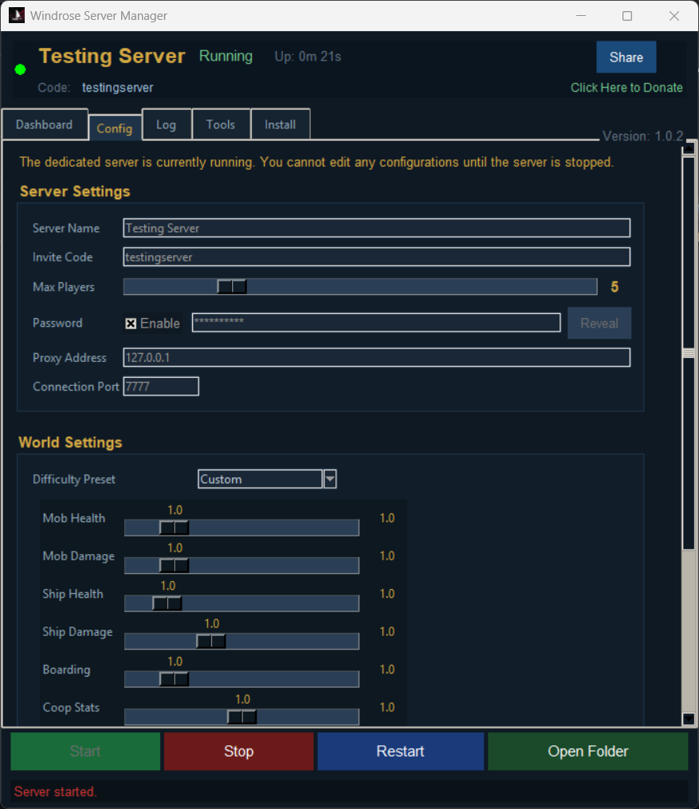
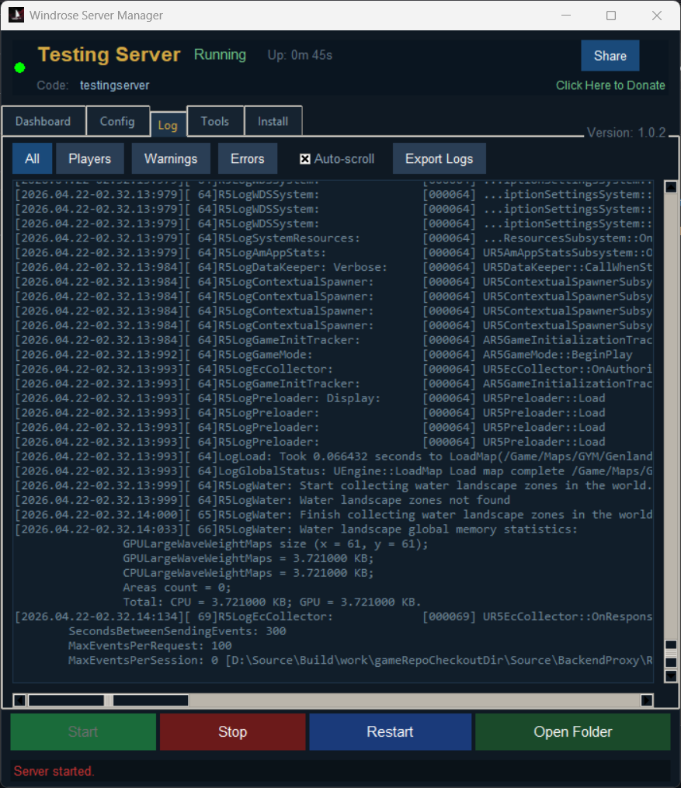
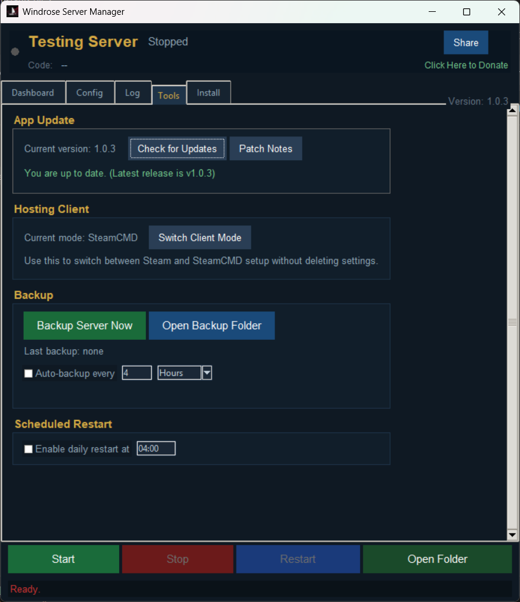

# Windrose Server Manager Enhanced

An Open Source dedicated server manager for [Windrose](https://store.steampowered.com/app/3041230/Windrose/)

---

## Features

- **Steam and SteamCMD support** - With ability to switch on-demand
- **Guided Installation Wizard** — When first launching the Server Manager you will be guided on how to get your dedicated server up and running via Steam or SteamCMD
- **Discord Integration** - Send notifications to a Discord channel when the server starts, stops, restarts, schedules a restart, or crashes
- **One-click Start / Stop / Restart**
- **Automated Game Server Updater**
- **Automated Server Manager Updater**
- **Live dashboard** — CPU usage, RAM, player count, uptime, and connected player list
- **Live Insights**
    - Player Activity - See individual player information.
    - Most Active Times - See when your server is most active. Complete with a 24 hour graph!
- **Live log viewer** — color-coded, filterable (All / Players / Warnings / Errors) with auto-scroll toggle
- **Config editor** — Edit Server and Gameplay settings directly from the manager
- **One-click world backup** — Zip your save data to a timestamped archive
- **Auto-backup** — Schedule automatic backups at customized times (Hours or Minutes)
- **Scheduled daily restarts**
- **Auto-restart on crash** — Relaunches automatically if the server is not running
- **Player history** — Persistent log of who joined and left
- **Invite code share** — Copies a ready-to-send message to clipboard
---

## Requirements

- Windows 10 or Windows 11
- Steam or SteamCMD

---

### How to Run

1. **Download the latest version** - https://github.com/Andrew1175/Windrose-Server-Manager-Enhanced/releases/latest. Do not download the debug version unless you're encountering issues.
2. Extract the .zip to a folder of your choice. Be sure to keep all contents in the .zip together:
    - Windrose-Server-Manager.exe
    - _internal (Folder)
3. **Run `Windrose-Server-Manager.exe`**
4. Follow the Setup Wizard to configure a new dedicated server or to use your pre-existing one.
5. Click **Install Server** — Only if using SteamCMD.
6. Switch to the **Dashboard** tab and click **Start**.

---

## Screenshots

| Dashboard                          | Insights                       |
| ---------------------------------- | ---------------------------- |
|  |  |

| Config                    | Log                    |
| ---------------------- | ---------------------- |
|  |  |

| Tools                    |                     |
| ---------------------- | ---------------------- |
|  |  |

---

## Contributers

Original GUI Design By: (https://github.com/psbrowand/Windrose-Server-Manager)
